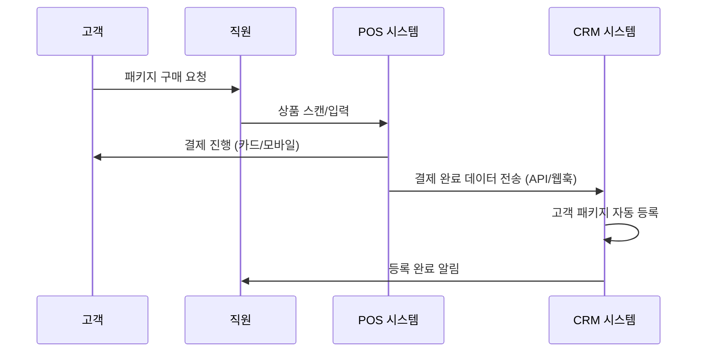

# 바이오해킹 센터 결제 시스템 연동 가이드

## 현재 상황 분석
- **결제 방식**: 매장 현장에서 실물카드, 삼성페이 등 모바일 결제
- **결제 위치**: 오프라인 매장 (현장 결제)
- **필요 기능**: 현장 결제 후 CRM 시스템에 자동 연동

## 1. POS 시스템 연동 방안

### A. 기존 POS 시스템 연동 (권장)
현재 사용 중인 POS 시스템과 API 연동을 통해 결제 정보를 자동으로 CRM에 동기화

#### 필요한 정보
1. **현재 사용 중인 POS 시스템 정보**
   - POS 제조사 및 모델명
   - 설치된 POS 소프트웨어 버전
   - API 지원 여부
   - 네트워크 연결 방식

2. **POS 시스템 API 정보**
   - API 엔드포인트 URL
   - 인증 방식 (API Key, OAuth 등)
   - 지원하는 데이터 포맷 (JSON, XML 등)
   - 웹훅(Webhook) 지원 여부

#### 연동 프로세스


### B. 대표적인 POS 시스템별 연동 방법

#### 1. 포스뱅크 (POSBANK)
- **API 지원**: REST API 제공
- **연동 방식**: HTTP POST 요청으로 실시간 결제 데이터 수신
- **필요 정보**: 가맹점 ID, API 키, 엔드포인트 URL

#### 2. 키오스크뱅크 (KioskBank)
- **API 지원**: JSON 기반 API
- **연동 방식**: 웹훅을 통한 결제 완료 알림
- **필요 정보**: 웹훅 URL, 인증 토큰

#### 3. 스마트카라 (SmartKara)
- **API 지원**: RESTful API
- **연동 방식**: 폴링 또는 웹훅 방식
- **필요 정보**: 매장 코드, API 인증키

#### 4. 하이POS
- **API 지원**: XML/JSON API
- **연동 방식**: FTP 파일 전송 또는 실시간 API
- **필요 정보**: FTP 서버 정보 또는 API 엔드포인트

## 2. 카드사/결제대행사 연동 방안

### A. VAN사 연동 (Value Added Network)
대부분의 POS 시스템이 VAN사를 통해 카드 승인을 처리하므로 VAN사 API 연동 고려

#### 주요 VAN사
1. **KICC (한국정보통신)**
   - API: KICC API Gateway
   - 특징: 실시간 결제 데이터 제공
   - 연동 방식: REST API, 웹훅

2. **KSNET**
   - API: KSNET API
   - 특징: 다양한 결제 수단 지원
   - 연동 방식: HTTP API, 파일 전송

3. **나이스정보통신**
   - API: 나이스페이먼츠 API
   - 특징: 통합 결제 솔루션
   - 연동 방식: REST API, 웹훅

### B. 간편결제 연동
삼성페이 등 간편결제 사용 시

#### 1. 삼성페이
- **연동 방식**: Samsung Pay Partner API
- **필요 정보**: 파트너 ID, API 키, 매장 식별자
- **데이터**: 결제 금액, 시간, 고객 정보 (마스킹)

#### 2. 카카오페이
- **연동 방식**: 카카오페이 API
- **필요 정보**: 가맹점 코드, CID, 시크릿 키

## 3. 개발 구현 방안

### A. 결제 정보 수신 API 개발

#### FastAPI 엔드포인트 구조
```python
# backend/api/v1/payments_pos.py

@router.post("/pos/payment-webhook")
async def receive_pos_payment(
    payment_data: PaymentWebhookData,
    db: Session = Depends(get_db)
):
    """POS 시스템에서 결제 완료 데이터 수신"""
    try:
        # 1. 결제 데이터 검증
        validated_payment = validate_payment_data(payment_data)
        
        # 2. 고객 정보 매칭
        customer = match_customer_by_phone_or_card(
            phone=payment_data.customer_phone,
            card_number=payment_data.masked_card_number
        )
        
        # 3. 패키지 정보 생성
        package = create_package_from_payment(
            customer_id=customer.customer_id,
            payment_data=validated_payment
        )
        
        # 4. 결제 기록 저장
        payment_record = save_payment_record(validated_payment)
        
        return {"status": "success", "package_id": package.package_id}
        
    except Exception as e:
        logger.error(f"Payment webhook error: {str(e)}")
        raise HTTPException(status_code=400, detail=str(e))
```

#### 결제 데이터 스키마
```python
# schemas/payment_pos.py

class PaymentWebhookData(BaseModel):
    # 결제 정보
    transaction_id: str          # 거래 고유 ID
    amount: int                  # 결제 금액
    payment_method: str          # 결제 수단 (card, samsung_pay, etc.)
    payment_time: datetime       # 결제 시간
    
    # 고객 정보
    customer_phone: Optional[str] = None    # 고객 전화번호
    masked_card_number: Optional[str] = None # 마스킹된 카드번호
    
    # 상품 정보
    product_code: str            # 패키지 상품 코드
    product_name: str            # 패키지 이름
    quantity: int = 1            # 수량
    
    # POS 정보
    pos_terminal_id: str         # POS 단말기 ID
    store_id: str               # 매장 ID
    staff_id: Optional[str] = None # 담당 직원 ID
    
    # 인증 정보
    signature: str               # 데이터 무결성 검증용 서명
```

### B. 고객 매칭 로직

#### 1. 전화번호 기반 매칭
```python
def match_customer_by_phone(phone: str) -> Customer:
    """전화번호로 고객 매칭"""
    customer = db.query(Customer).filter(
        Customer.phone == phone
    ).first()
    
    if not customer:
        # 신규 고객 생성 또는 수동 매칭 대기
        raise CustomerNotFoundError(f"Phone {phone} not found")
    
    return customer
```

#### 2. 카드번호 기반 매칭 (보조)
```python
def match_customer_by_card(masked_card: str) -> Customer:
    """마스킹된 카드번호로 고객 매칭 (보조 수단)"""
    # 이전 결제 기록에서 카드번호 매칭
    payment = db.query(Payment).filter(
        Payment.masked_card_number == masked_card
    ).first()
    
    if payment:
        return payment.customer
    
    return None
```

### C. 수동 매칭 인터페이스

#### 미매칭 결제 관리
```python
# 미매칭 결제 저장
class UnmatchedPayment(Base):
    __tablename__ = "unmatched_payments"
    
    id = Column(Integer, primary_key=True)
    transaction_id = Column(String, unique=True)
    amount = Column(Integer)
    payment_time = Column(DateTime)
    customer_phone = Column(String)
    product_code = Column(String)
    status = Column(String, default="pending")  # pending, matched, cancelled
    created_at = Column(DateTime, default=func.now())
```

#### 관리자 매칭 화면
- 미매칭 결제 목록 표시
- 고객 검색 및 수동 매칭
- 신규 고객 생성 후 매칭

## 4. 보안 고려사항

### A. 데이터 전송 보안
1. **HTTPS 필수**: 모든 API 통신은 HTTPS로 암호화
2. **API 키 관리**: 환경변수로 분리 저장
3. **서명 검증**: 결제 데이터 무결성 검증
4. **IP 화이트리스트**: 허용된 POS/VAN 시스템 IP만 접근 허용

### B. 개인정보 보호
1. **카드번호 마스킹**: 카드번호는 마스킹된 형태로만 저장
2. **로그 관리**: 민감정보는 로그에 기록하지 않음
3. **접근 권한**: 결제 정보는 관리자만 접근 가능

## 5. 구현 단계별 계획

### Phase 1: 수동 결제 등록 (즉시 구현 가능)
1. **관리자 화면에서 수동 등록**
   - 결제 완료 후 직원이 직접 CRM에 패키지 등록
   - 고객 선택, 패키지 선택, 결제 정보 입력

2. **구현 내용**
   - 패키지 구매 모달 UI 개발
   - 패키지 등록 API 개발
   - 결제 기록 저장

### Phase 2: POS 연동 준비 (2-4주)
1. **현재 POS 시스템 조사**
   - 사용 중인 POS 시스템 확인
   - API 지원 여부 및 문서 확보
   - 테스트 환경 구축

2. **기본 연동 구조 개발**
   - 웹훅 수신 API 개발
   - 결제 데이터 파싱 및 검증
   - 에러 처리 및 로깅

### Phase 3: 자동 연동 구현 (4-8주)
1. **실시간 연동 구현**
   - POS 시스템과 실시간 연동
   - 고객 자동 매칭
   - 패키지 자동 생성

2. **관리 기능 구현**
   - 미매칭 결제 관리
   - 수동 매칭 인터페이스
   - 결제 내역 조회 및 관리

## 6. 필요한 정보 수집 체크리스트

### □ POS 시스템 정보
- [ ] 현재 사용 중인 POS 시스템 제조사/모델
- [ ] POS 소프트웨어 버전
- [ ] 네트워크 연결 방식 (유선/무선)
- [ ] API 지원 여부
- [ ] 기술 담당자 연락처

### □ VAN사/결제대행사 정보
- [ ] 현재 계약된 VAN사명
- [ ] 가맹점 ID/코드
- [ ] API 사용 가능 여부
- [ ] 기술 지원 담당자 연락처

### □ 매장 운영 정보
- [ ] 주요 결제 수단 비율 (카드/현금/간편결제)
- [ ] 일평균 결제 건수
- [ ] 패키지 상품 코드 체계
- [ ] 직원 역할 및 권한

### □ 네트워크 환경
- [ ] 인터넷 연결 상태 (속도/안정성)
- [ ] 방화벽 설정
- [ ] 고정 IP 사용 여부

## 7. 예상 비용 및 개발 기간

### 개발 비용 (추정)
- **Phase 1 (수동 등록)**: 1-2주, 개발비 무료 (기존 시스템 확장)
- **Phase 2 (POS 연동 준비)**: 2-4주, 개발비 200-400만원
- **Phase 3 (자동 연동)**: 4-8주, 개발비 500-800만원

### 추가 비용
- **POS API 이용료**: 월 10-50만원 (POS 업체별 상이)
- **VAN사 API 이용료**: 월 5-30만원
- **SSL 인증서**: 연 10-50만원
- **보안 솔루션**: 월 20-100만원

## 8. 권장사항

1. **1단계 구현**: 수동 결제 등록부터 시작하여 업무 프로세스 최적화
2. **POS 업체 협의**: 현재 POS 업체와 API 연동 가능성 협의
3. **테스트 환경**: 실제 연동 전 충분한 테스트 환경에서 검증
4. **직원 교육**: 새로운 시스템 도입 시 직원 교육 계획 수립

현재 사용 중인 POS 시스템 정보를 확인해주시면, 더 구체적인 연동 방안을 제시해드릴 수 있습니다.