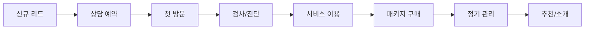

# AIBIO Center CRM 고도화 전략 및 로드맵

## 1. Executive Summary

AIBIO Center의 현재 CRM 시스템을 차세대 AI 기반 헬스케어 CRM으로 발전시키기 위한 전략 문서입니다. 고객 생애주기 전반에 걸친 개인화된 경험 제공과 데이터 기반 의사결정을 목표로 합니다.

## 2. 현재 시스템 분석

### 2.1 강점
- ✅ 통합된 예약-서비스-결제 워크플로우
- ✅ 실시간 대시보드 및 분석 기능
- ✅ 패키지 관리 및 자동 차감 시스템
- ✅ 카카오 알림톡 연동
- ✅ 고급 필터링 및 검색 기능

### 2.2 개선 기회
- 🔄 AI 기반 고객 행동 예측 부재
- 🔄 자동화된 마케팅 캠페인 기능 부족
- 🔄 고객 건강 데이터 통합 관리 미흡
- 🔄 멀티채널 커뮤니케이션 한계
- 🔄 고객 여정 맵핑 및 추적 부재

## 3. CRM 고도화 전략

### 3.1 Phase 1: AI 기반 고객 인사이트 (3개월)

#### 3.1.1 고객 세분화 AI
```python
# 구현 예시
class CustomerSegmentationAI:
    """
    머신러닝 기반 고객 자동 세분화
    - RFM 분석 (Recency, Frequency, Monetary)
    - 클러스터링을 통한 고객 그룹 자동 생성
    - 이탈 예측 모델
    """
    
    segments = {
        "VIP": "높은 매출, 빈번한 방문",
        "성장잠재": "최근 가입, 활발한 이용",
        "휴면위험": "방문 주기 증가",
        "재활성화대상": "3개월 이상 미방문"
    }
```

#### 3.1.2 서비스 추천 엔진
- 협업 필터링 기반 개인화 추천
- 건강 상태와 서비스 이력 기반 맞춤 추천
- 패키지 업셀/크로스셀 기회 자동 식별

#### 3.1.3 고객 건강 점수
- 검사 결과 통합 관리
- 건강 개선 추이 시각화
- 위험 지표 자동 알림

### 3.2 Phase 2: 옴니채널 커뮤니케이션 (2개월)

#### 3.2.1 통합 메시징 플랫폼
```yaml
channels:
  - kakao_talk: 예약 확인, 리마인더
  - sms: 긴급 알림, 프로모션
  - email: 뉴스레터, 상세 리포트
  - app_push: 실시간 알림
  - web_chat: 실시간 상담
```

#### 3.2.2 자동화 마케팅 캠페인
- 이벤트 기반 자동 메시지 발송
- A/B 테스트 기능
- 캠페인 성과 분석

#### 3.2.3 고객 피드백 루프
- 서비스 후 자동 만족도 조사
- NPS (Net Promoter Score) 추적
- 리뷰 및 평점 관리

### 3.3 Phase 3: 고객 여정 자동화 (3개월)

#### 3.3.1 Customer Journey Mapping


#### 3.3.2 라이프사이클 자동화
- 신규 고객 온보딩 프로세스
- 정기 관리 자동 스케줄링
- 패키지 만료 전 갱신 유도

#### 3.3.3 고객 포털/앱
- 개인 건강 대시보드
- 예약 및 결제 셀프서비스
- 건강 기록 및 추이 확인

### 3.4 Phase 4: 예측 분석 및 비즈니스 인텔리전스 (2개월)

#### 3.4.1 예측 모델
- 매출 예측 모델
- 예약 노쇼 예측
- 계절별 수요 예측
- 고객 LTV (생애가치) 계산

#### 3.4.2 실시간 BI 대시보드
```typescript
interface AdvancedDashboard {
  // 실시간 KPI
  realTimeMetrics: {
    activeCustomers: number;
    todayRevenue: number;
    utilizationRate: number;
    customerSatisfaction: number;
  };
  
  // 예측 지표
  predictions: {
    monthlyRevenueForecast: number;
    churnRiskCustomers: Customer[];
    recommendedActions: Action[];
  };
  
  // 인사이트
  insights: {
    topPerformingServices: Service[];
    customerSegmentTrends: Trend[];
    marketingROI: Campaign[];
  };
}
```

#### 3.4.3 자동 리포트 생성
- 일일/주간/월간 자동 리포트
- 맞춤형 KPI 대시보드
- 이상 징후 자동 감지 및 알림

## 4. 기술 스택 제안

### 4.1 백엔드 확장
```yaml
ai_ml:
  - tensorflow/pytorch: 딥러닝 모델
  - scikit-learn: 머신러닝
  - pandas/numpy: 데이터 분석
  
streaming:
  - kafka/redis-streams: 실시간 데이터 처리
  - celery: 비동기 작업 처리
  
analytics:
  - elasticsearch: 검색 및 분석
  - grafana: 모니터링
  - metabase: 비즈니스 인텔리전스
```

### 4.2 프론트엔드 개선
```yaml
visualization:
  - d3.js/recharts: 고급 차트
  - react-flow: 고객 여정 시각화
  
mobile:
  - react-native: 크로스플랫폼 앱
  - push-notifications: 푸시 알림
  
real-time:
  - socket.io: 실시간 통신
  - webrtc: 화상 상담
```

## 5. 구현 로드맵

### Year 2025 Q1-Q2
- [ ] AI 고객 세분화 모델 개발
- [ ] 서비스 추천 엔진 구현
- [ ] 통합 메시징 플랫폼 구축
- [ ] 고객 건강 점수 시스템

### Year 2025 Q3-Q4
- [ ] 마케팅 자동화 캠페인
- [ ] 고객 여정 맵핑 도구
- [ ] 모바일 앱 출시
- [ ] 예측 분석 모델 배포

### Year 2026 Q1
- [ ] AI 챗봇 도입
- [ ] 음성 인식 예약 시스템
- [ ] IoT 디바이스 연동
- [ ] 글로벌 확장 준비

## 6. 기대 효과

### 6.1 정량적 효과
- 🎯 고객 만족도 20% 향상
- 🎯 평균 고객 생애가치 30% 증가
- 🎯 마케팅 ROI 40% 개선
- 🎯 운영 효율성 25% 향상

### 6.2 정성적 효과
- ✨ 개인화된 고객 경험 제공
- ✨ 데이터 기반 의사결정 문화
- ✨ 직원 업무 만족도 향상
- ✨ 시장 경쟁력 강화

## 7. 리스크 및 대응 방안

### 7.1 기술적 리스크
- **데이터 품질**: 데이터 검증 프로세스 구축
- **시스템 복잡도**: 마이크로서비스 아키텍처 채택
- **보안 위험**: GDPR/개인정보보호법 준수

### 7.2 비즈니스 리스크
- **변화 저항**: 단계적 도입 및 교육
- **투자 대비 효과**: MVP 접근 및 빠른 검증
- **경쟁사 대응**: 차별화된 가치 제안

## 8. 성공 지표 (KPIs)

### 8.1 고객 지표
- Customer Acquisition Cost (CAC)
- Customer Lifetime Value (CLV)
- Net Promoter Score (NPS)
- Customer Retention Rate

### 8.2 운영 지표
- Average Revenue Per User (ARPU)
- Service Utilization Rate
- Appointment No-show Rate
- Staff Productivity

### 8.3 기술 지표
- System Uptime (99.9%)
- API Response Time (<200ms)
- Data Processing Latency
- Model Accuracy (>85%)

## 9. 결론

AIBIO Center의 CRM 고도화는 단순한 시스템 업그레이드가 아닌, 고객 중심의 디지털 트랜스포메이션입니다. AI와 데이터 분석을 활용하여 개인화된 헬스케어 경험을 제공하고, 효율적인 운영을 통해 지속 가능한 성장을 이룰 수 있을 것입니다.

### 다음 단계
1. 경영진 승인 및 예산 확보
2. 전담 TF 구성
3. Phase 1 상세 설계
4. POC (Proof of Concept) 개발
5. 단계적 롤아웃

---

*이 문서는 AIBIO Center의 미래 비전을 담은 전략 문서입니다.*
*작성일: 2025년 1월 7일*