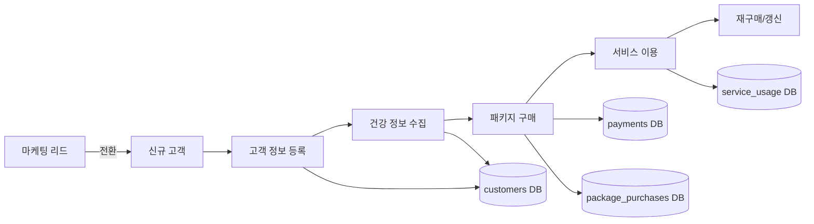
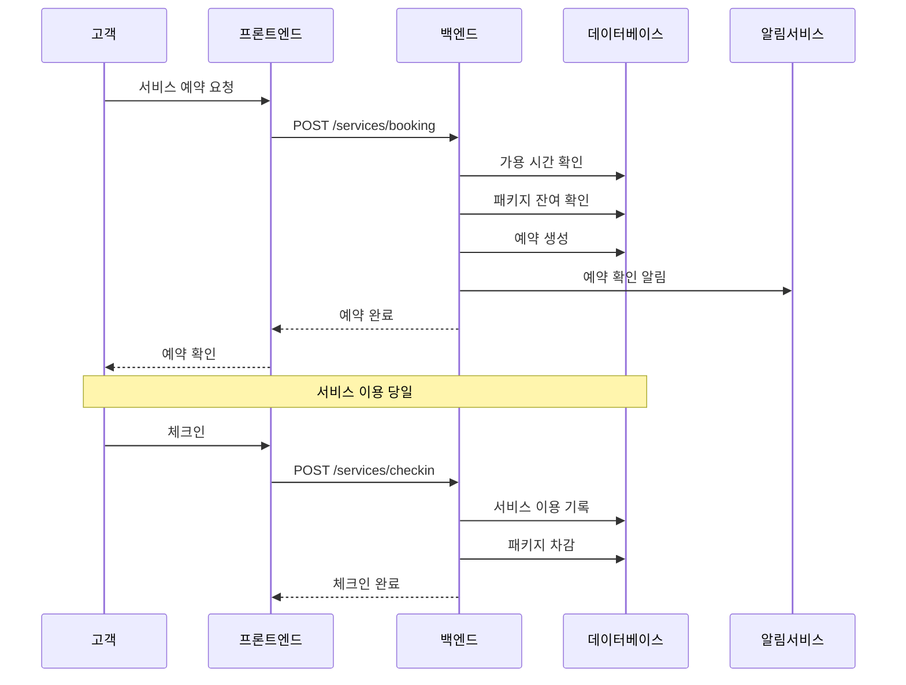
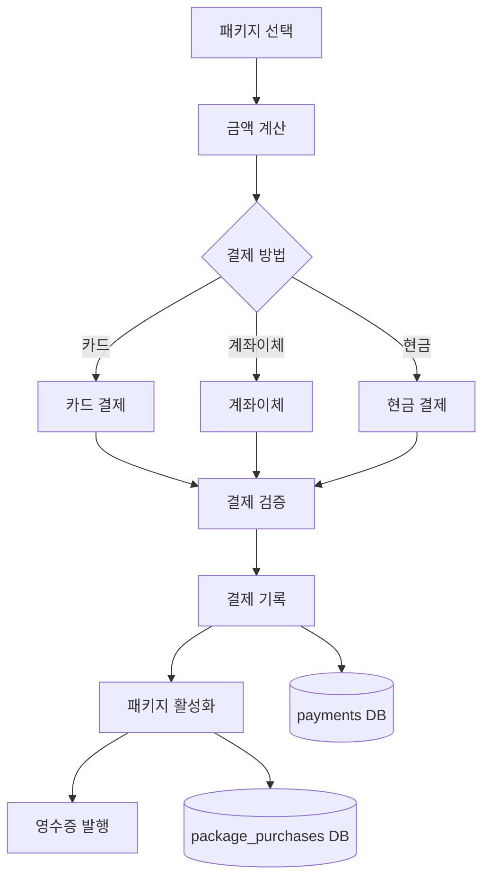
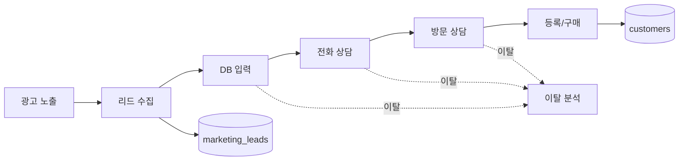
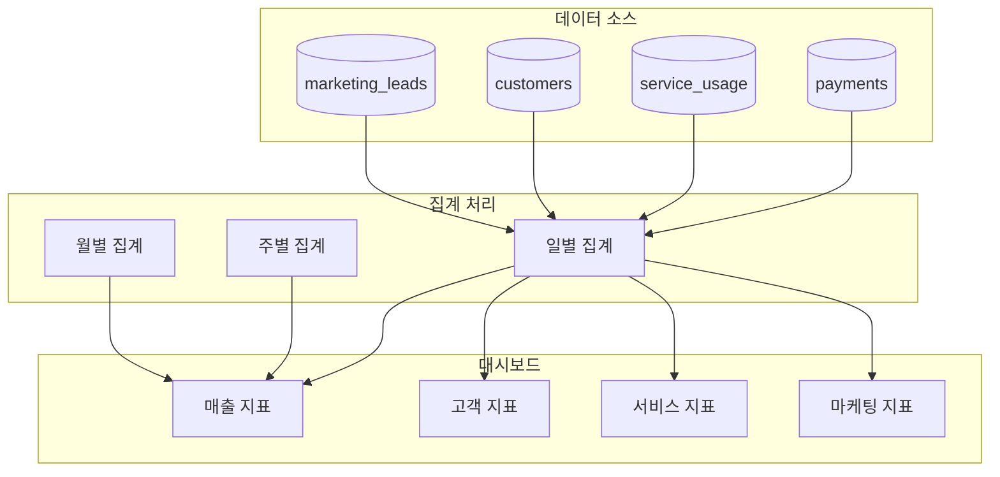
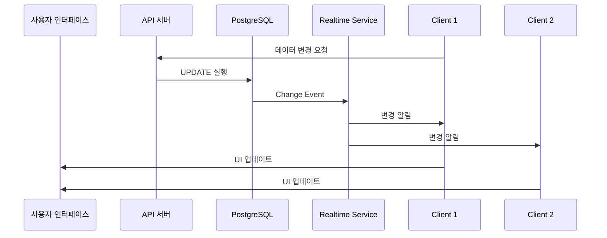
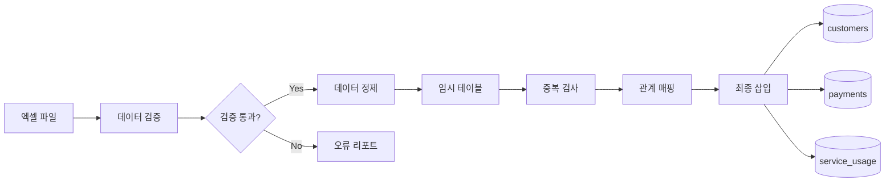

# AIBIO 센터 관리 시스템 - 데이터 플로우 설계

## 1. 주요 데이터 플로우 개요

시스템의 데이터는 크게 5개의 주요 플로우로 구성됩니다:

1. **고객 라이프사이클 플로우**
2. **서비스 이용 플로우**
3. **결제 및 패키지 플로우**
4. **마케팅 리드 플로우**
5. **보고서 및 분석 플로우**

## 2. 고객 라이프사이클 플로우

### 2.1 신규 고객 등록


### 2.2 고객 정보 흐름
```typescript
// 1. 리드에서 고객으로 전환
interface LeadToCustomerFlow {
  lead_id: number;
  customer_data: {
    name: string;
    phone: string;
    referral_source: string;
  };
  conversion_date: Date;
}

// 2. 고객 정보 업데이트
interface CustomerUpdateFlow {
  customer_id: number;
  updates: Partial<Customer>;
  updated_by: string;
  timestamp: Date;
}
```

## 3. 서비스 이용 플로우

### 3.1 서비스 예약 및 이용


### 3.2 패키지 잔여 관리
```typescript
// 패키지 차감 로직
interface PackageDeductionFlow {
  customer_id: number;
  package_id: number;
  service_type: ServiceType;
  
  process: {
    1: "현재 잔여 횟수 확인";
    2: "서비스 이용 가능 여부 검증";
    3: "서비스 이용 기록 생성";
    4: "패키지 잔여 횟수 차감";
    5: "트랜잭션 커밋";
  };
}
```

## 4. 결제 및 패키지 플로우

### 4.1 결제 프로세스


### 4.2 결제 데이터 흐름
```typescript
// 결제 처리 플로우
interface PaymentFlow {
  // 1. 결제 요청
  request: {
    customer_id: number;
    package_id: number;
    amount: number;
    payment_method: PaymentMethod;
  };
  
  // 2. 결제 처리
  processing: {
    validate_amount: boolean;
    process_payment: PaymentResult;
    record_transaction: number; // transaction_id
  };
  
  // 3. 패키지 활성화
  activation: {
    purchase_id: number;
    valid_from: Date;
    valid_until: Date;
    total_sessions: number;
  };
  
  // 4. 알림 발송
  notification: {
    receipt: boolean;
    sms: boolean;
    email: boolean;
  };
}
```

## 5. 마케팅 리드 플로우

### 5.1 리드 퍼널


### 5.2 리드 추적 데이터
```typescript
// 리드 상태 전환 추적
interface LeadTrackingFlow {
  lead_id: number;
  stages: {
    collected: { date: Date; channel: string };
    db_entered: { date: Date; staff: string };
    phone_consulted: { date: Date; result: string };
    visit_consulted: { date: Date; notes: string };
    converted: { date: Date; customer_id: number };
  };
  
  metrics: {
    days_to_convert: number;
    touchpoints: number;
    conversion_rate: number;
  };
}
```

## 6. 보고서 및 분석 플로우

### 6.1 실시간 대시보드 데이터


### 6.2 보고서 생성 플로우
```typescript
// 보고서 생성 파이프라인
interface ReportGenerationFlow {
  // 1. 데이터 수집
  collection: {
    date_range: { from: Date; to: Date };
    sources: string[];
    filters: Record<string, any>;
  };
  
  // 2. 데이터 처리
  processing: {
    aggregation: AggregationType[];
    calculations: Calculation[];
    formatting: FormatRule[];
  };
  
  // 3. 보고서 생성
  generation: {
    template: string;
    format: 'pdf' | 'excel' | 'json';
    delivery: 'download' | 'email' | 'storage';
  };
}
```

## 7. 데이터 동기화 및 일관성

### 7.1 실시간 동기화


### 7.2 트랜잭션 관리
```typescript
// 복잡한 트랜잭션 예시: 서비스 이용 등록
async function registerServiceUsage(data: ServiceUsageData) {
  const transaction = await db.transaction();
  
  try {
    // 1. 서비스 이용 기록 생성
    const usage = await transaction.serviceUsage.create(data);
    
    // 2. 패키지 잔여 횟수 차감
    await transaction.packagePurchases.update({
      where: { id: data.package_id },
      data: { 
        used_sessions: { increment: 1 },
        remaining_sessions: { decrement: 1 }
      }
    });
    
    // 3. 고객 최근 방문일 업데이트
    await transaction.customers.update({
      where: { id: data.customer_id },
      data: { last_visit_date: new Date() }
    });
    
    // 4. 감사 로그 생성
    await transaction.auditLogs.create({
      action: 'SERVICE_USAGE_REGISTERED',
      entity_type: 'service_usage',
      entity_id: usage.id,
      user_id: data.created_by
    });
    
    await transaction.commit();
    return usage;
  } catch (error) {
    await transaction.rollback();
    throw error;
  }
}
```

## 8. 데이터 캐싱 전략

### 8.1 캐싱 레이어
```
┌─────────────┐     ┌─────────────┐     ┌─────────────┐
│   Client    │────▶│ Cache Layer │────▶│  Database   │
│  (React)    │◀────│   (Redis)   │◀────│(PostgreSQL) │
└─────────────┘     └─────────────┘     └─────────────┘
```

### 8.2 캐시 키 전략
```typescript
// 캐시 키 패턴
const cacheKeys = {
  customer: (id: number) => `customer:${id}`,
  customerList: (page: number) => `customers:page:${page}`,
  dailyRevenue: (date: string) => `revenue:daily:${date}`,
  serviceStats: (month: string) => `stats:service:${month}`,
  userSession: (userId: number) => `session:user:${userId}`
};

// 캐시 무효화 전략
const invalidateCache = {
  onCustomerUpdate: (id: number) => [
    cacheKeys.customer(id),
    'customers:page:*'
  ],
  onPaymentCreate: () => [
    'revenue:daily:*',
    'stats:*'
  ]
};
```

## 9. 데이터 마이그레이션 플로우

### 9.1 엑셀 → 데이터베이스


### 9.2 데이터 정제 규칙
```typescript
// 데이터 정제 파이프라인
interface DataCleansingPipeline {
  // 1. 형식 표준화
  standardize: {
    phone: (value: string) => string; // 010-1234-5678
    date: (value: any) => Date; // YYYY-MM-DD
    amount: (value: any) => number; // 숫자만 추출
  };
  
  // 2. 유효성 검증
  validate: {
    required: string[];
    unique: string[];
    format: Record<string, RegExp>;
  };
  
  // 3. 관계 매핑
  mapping: {
    findOrCreateCustomer: (data: any) => number;
    mapServiceType: (korean: string) => ServiceType;
    mapPaymentMethod: (method: string) => PaymentMethod;
  };
}
```

## 10. 성능 최적화 데이터 플로우

### 10.1 대용량 데이터 처리
```typescript
// 스트리밍 방식의 대용량 데이터 처리
async function* streamLargeDataset(query: Query) {
  const batchSize = 1000;
  let offset = 0;
  
  while (true) {
    const batch = await db.query({
      ...query,
      limit: batchSize,
      offset
    });
    
    if (batch.length === 0) break;
    
    yield batch;
    offset += batchSize;
  }
}

// 사용 예시
for await (const batch of streamLargeDataset(query)) {
  await processBatch(batch);
}
```

### 10.2 집계 데이터 사전 계산
```sql
-- 일별 집계 뷰
CREATE MATERIALIZED VIEW daily_stats AS
SELECT 
  date_trunc('day', created_at) as date,
  COUNT(DISTINCT customer_id) as unique_customers,
  COUNT(*) as total_services,
  SUM(amount) as revenue
FROM service_usage
JOIN payments ON ...
GROUP BY date;

-- 자동 갱신 설정
CREATE INDEX idx_daily_stats_date ON daily_stats(date);
REFRESH MATERIALIZED VIEW daily_stats;
```