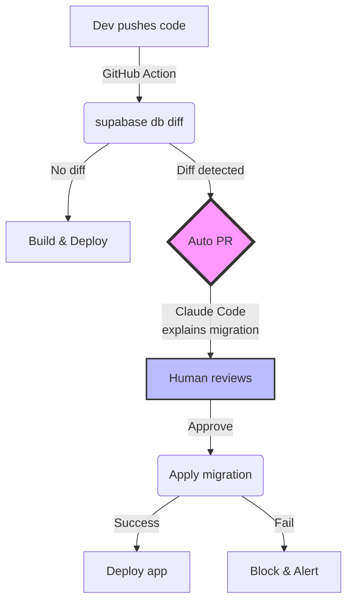

# 🤖 스키마 동기화 자동화 가이드 - "수동 SQL 루프 끊기"

> "SQL을 수동으로 때려 넣느냐 vs. 스키마-코드 동기화 파이프라인을 갖추느냐"  
> 선택이 아니라 필수다.

## 📋 현재 문제점

현재 겪고 있는 "수동 SQL → 500 에러 → 디버그" 루프:
1. 코드 변경 → 배포
2. 프로덕션에서 500 에러 발생
3. 로그 확인 → "column not found"
4. Supabase에 수동으로 SQL 실행
5. 다시 배포...

이런 반복을 **자동화와 예방**으로 해결하자!

## 🚀 자동화 솔루션 아키텍처



## 📦 구현 단계별 가이드

### 1️⃣ CI 단계 - 스키마 드리프트 자동 감지

#### GitHub Actions 워크플로우
```yaml
# .github/workflows/schema-check.yml
name: Schema Drift Detection

on:
  pull_request:
    paths:
      - 'backend/models/**'
      - 'backend/alembic/**'
      - 'supabase/migrations/**'
  push:
    branches: [main]

jobs:
  schema-diff:
    runs-on: ubuntu-latest
    steps:
      - uses: actions/checkout@v3
      
      - name: Setup Supabase CLI
        uses: supabase/setup-cli@v1
        with:
          version: latest
      
      - name: Check Schema Drift
        env:
          SUPABASE_ACCESS_TOKEN: ${{ secrets.SUPABASE_ACCESS_TOKEN }}
          SUPABASE_PROJECT_ID: ${{ secrets.SUPABASE_PROJECT_ID }}
        run: |
          # DB 연결
          supabase link --project-ref $SUPABASE_PROJECT_ID
          
          # 스키마 차이 감지
          supabase db diff --schema public > schema_diff.sql
          
          # 차이가 있으면 PR 생성
          if [ -s schema_diff.sql ]; then
            echo "::set-output name=has_drift::true"
            echo "::set-output name=diff_file::schema_diff.sql"
          fi
      
      - name: Create PR with Migration
        if: steps.schema-diff.outputs.has_drift == 'true'
        uses: peter-evans/create-pull-request@v5
        with:
          token: ${{ secrets.GITHUB_TOKEN }}
          commit-message: "fix: 스키마 드리프트 자동 수정"
          title: "🤖 [자동 생성] 데이터베이스 스키마 동기화"
          body: |
            ## 🔍 스키마 드리프트 감지됨
            
            ORM 모델과 실제 데이터베이스 스키마 간 차이를 발견했습니다.
            
            ### 변경 사항
            ```sql
            ${{ steps.schema-diff.outputs.diff_content }}
            ```
            
            ### Claude Code 분석
            @claude-code-bot 이 마이그레이션의 영향도를 분석해주세요.
          branch: auto/schema-sync-${{ github.run_number }}
```

### 2️⃣ LLM 에이전트 통합 - PR 자동 리뷰

#### Claude Code Bot 설정
```python
# scripts/claude_pr_reviewer.py
import os
from github import Github
from anthropic import Anthropic

class SchemaPRReviewer:
    def __init__(self):
        self.github = Github(os.getenv("GITHUB_TOKEN"))
        self.claude = Anthropic(api_key=os.getenv("ANTHROPIC_API_KEY"))
    
    def analyze_migration(self, pr_number: int):
        repo = self.github.get_repo("user/repo")
        pr = repo.get_pull(pr_number)
        
        # 마이그레이션 파일 내용 가져오기
        files = pr.get_files()
        migration_content = self._get_migration_content(files)
        
        # Claude에게 분석 요청
        response = self.claude.messages.create(
            model="claude-3-opus-20240229",
            messages=[{
                "role": "user",
                "content": f"""
                다음 데이터베이스 마이그레이션을 분석해주세요:
                
                {migration_content}
                
                다음 항목을 포함해서 분석하세요:
                1. 위험도 평가 (Low/Medium/High)
                2. 영향받는 테이블과 기능
                3. 롤백 가능 여부
                4. 권장 테스트 시나리오
                5. ERD 다이어그램 (Mermaid)
                """
            }]
        )
        
        # PR에 코멘트 작성
        pr.create_issue_comment(f"""
        ## 🤖 Claude Code 자동 분석 결과
        
        {response.content}
        
        ---
        *이 분석은 AI에 의해 자동 생성되었습니다.*
        """)
```

### 3️⃣ 타입 안전성 - 컴파일 타임 검증

#### TypeScript 타입 자동 생성
```bash
# scripts/generate-types.sh
#!/bin/bash

# Supabase에서 타입 생성
supabase gen types typescript --project-id $SUPABASE_PROJECT_ID > frontend/types/database.types.ts

# Prisma 사용 시
npx prisma generate

# 타입 체크
cd frontend && npm run type-check
```

#### CI에 통합
```yaml
- name: Generate & Check Types
  run: |
    ./scripts/generate-types.sh
    
    # 타입 에러가 있으면 실패
    if [ $? -ne 0 ]; then
      echo "❌ 타입 불일치 발견!"
      exit 1
    fi
```

### 4️⃣ 런타임 Self-Healing

#### 500 에러 자동 분석 및 수정
```python
# scripts/runtime_healer.py
import re
from typing import Optional

class RuntimeHealer:
    def __init__(self, supabase_client, claude_client):
        self.db = supabase_client
        self.llm = claude_client
    
    def analyze_500_error(self, error_log: str) -> Optional[str]:
        """500 에러 로그를 분석하여 SQL 패치 생성"""
        
        # 패턴 매칭: column not found
        column_pattern = r'column "(\w+)" of relation "(\w+)" does not exist'
        match = re.search(column_pattern, error_log)
        
        if match:
            column_name = match.group(1)
            table_name = match.group(2)
            
            # LLM에게 수정 SQL 요청
            fix_sql = self.llm.messages.create(
                model="claude-3-opus-20240229",
                messages=[{
                    "role": "user",
                    "content": f"""
                    Supabase 테이블 '{table_name}'에 '{column_name}' 컬럼이 없습니다.
                    이를 추가하는 안전한 ALTER TABLE 문을 생성해주세요.
                    
                    고려사항:
                    - 적절한 데이터 타입 추론
                    - NULL 허용 여부
                    - 기본값 설정
                    - 인덱스 필요성
                    """
                }]
            ).content
            
            return fix_sql
        
        return None
    
    def create_healing_pr(self, sql_patch: str, error_context: str):
        """자동 수정 PR 생성"""
        # PR 생성 로직
        pass
```

### 5️⃣ Supabase 문서 참조 (선택사항)

스키마 작성 시 Supabase 공식 문서를 참조하는 간단한 방법:

```bash
# Supabase 문서 클론 (최초 1회)
git clone --depth 1 https://github.com/supabase/supabase.git

# 필요한 SQL 패턴 검색
grep -r "CREATE TABLE" supabase/apps/docs/pages/guides/
grep -r "ALTER TABLE" supabase/apps/docs/pages/guides/
```

더 고급 기능이 필요하면 LangChain이나 LlamaIndex를 활용할 수 있지만, 대부분의 경우 위 방법으로 충분합니다.

## 🛠️ 도구 및 패턴 선택 가이드

### 옵션 비교

| 옵션 | 장점 | 단점 | 추천 상황 |
|------|------|------|-----------|
| **Supabase CLI + GitHub Actions** | - 공식 지원<br>- 설정 간단<br>- 무료 | - 복잡한 마이그레이션 제한적 | 대부분의 프로젝트 |
| **Prisma Migrate** | - 타입 안전<br>- drift 자동 감지<br>- 롤백 지원 | - PostgREST와 충돌 가능<br>- 학습 곡선 | TypeScript 중심 프로젝트 |
| **Declarative Schema** | - Git으로 스키마 버전 관리<br>- 리뷰 용이 | - 파일 순서 관리 필요 | 대규모 팀 프로젝트 |
| **Preview Databases** | - 완벽한 테스트 환경<br>- 실제 DB와 동일 | - 비용 발생<br>- 생성 시간 | 중요한 변경사항 |

### 단계별 도입 전략

#### Phase 1: 기본 자동화 (1주)
- [ ] GitHub Actions로 `supabase db diff` 자동화
- [ ] 스키마 차이 발견 시 알림
- [ ] 수동 PR 생성

#### Phase 2: LLM 통합 (2주)
- [ ] Claude Code Bot 설정
- [ ] 자동 PR 리뷰 및 위험도 평가
- [ ] ERD 자동 생성

#### Phase 3: 타입 안전성 (1주)
- [ ] TypeScript 타입 자동 생성
- [ ] CI에서 타입 체크
- [ ] 컴파일 실패 시 배포 차단

#### Phase 4: Self-Healing (2주)
- [ ] 500 에러 패턴 분석
- [ ] 자동 수정 SQL 생성
- [ ] Human-in-the-loop PR 생성

#### Phase 5: RAG 지원 (1주)
- [ ] Supabase 문서 임베딩
- [ ] 사내 SQL 가이드 추가
- [ ] 컨텍스트 기반 도움말

## 💡 핵심 이점

1. **예방적 접근**: 프로덕션 에러 발생 전 감지
2. **자동화**: 수동 작업 80% 감소
3. **안전성**: Human-in-the-loop으로 위험 제어
4. **학습**: LLM이 팀의 SQL 패턴 학습
5. **문서화**: 모든 변경사항 자동 기록

## 🎯 즉시 실행 가능한 Quick Win

### 오늘 당장 할 수 있는 것:
```bash
# 1. 로컬에서 스키마 차이 확인
supabase db diff --schema public

# 2. GitHub Actions 설정 (위 YAML 복사)
mkdir -p .github/workflows
cp schema-check.yml .github/workflows/

# 3. 환경 변수 설정
# GitHub Settings > Secrets에 추가:
# - SUPABASE_ACCESS_TOKEN
# - SUPABASE_PROJECT_ID
```

## 📚 참고 자료

- [Supabase CLI Reference](https://supabase.com/docs/reference/cli)
- [GitHub Actions for Supabase](https://github.com/marketplace/actions/supabase-cli)
- [Prisma + Supabase Guide](https://www.prisma.io/docs/guides/database/supabase)
- [Railway Deployment Best Practices](https://docs.railway.app/guides/deployments)

---

**"더 이상 수동 SQL은 없다. 자동화가 답이다!"** 🚀