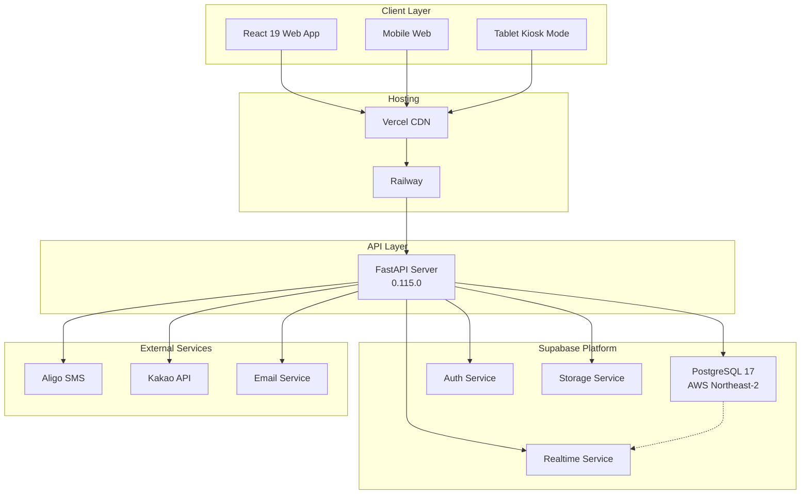
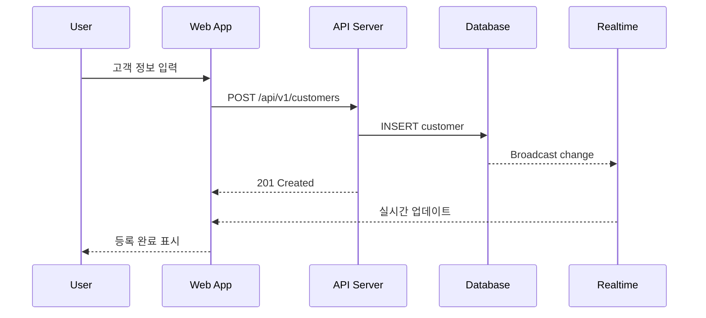
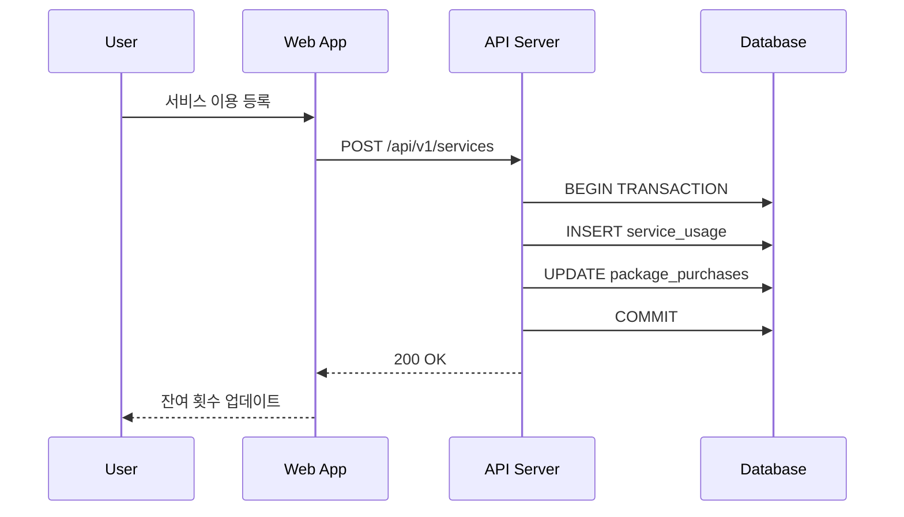
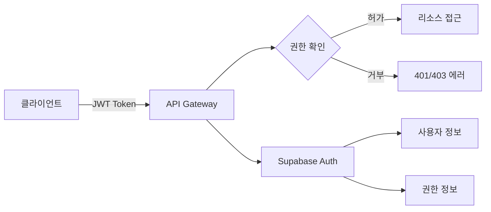

# AIBIO 센터 관리 시스템 - 시스템 전체 구조

> 버전: 2.0.0
> 최종 업데이트: 2025-06-22
> 작성자: Hephaistos

## 1. 시스템 아키텍처 개요



## 2. 레이어별 상세 설명

### 2.1 클라이언트 레이어

#### Web Application (React 19.1.0)
- **역할**: 사용자 인터페이스 제공
- **기술 스택**:
  - React 19.1.0 + TypeScript 5.8.3
  - Vite 6.3.5 (빌드 도구)
  - Tailwind CSS 4.1.8
  - React Query 5.80.2 (상태 관리)
  - React Router 7.6.2
  - Recharts 2.15.3 (차트)
  - Axios 1.9.0 (API 통신)
- **주요 기능**:
  - 반응형 디자인 (데스크톱/태블릿/모바일)
  - 실시간 데이터 업데이트 (Supabase Realtime)
  - 태블릿 키오스크 모드 (설문 조사)

#### 주요 페이지 구조
```
/                     # 대시보드
/customers            # 고객 관리
/customers/:id        # 고객 상세
/customer-leads       # 리드 관리
/services             # 서비스 이용 관리
/payments             # 결제 관리
/packages             # 패키지 관리
/reservations         # 예약 관리
/kits                 # 키트 관리
/staff-schedule       # 직원 일정 관리
/reports              # 보고서
/settings             # 설정
/tablet-questionnaire # 태블릿 설문 (키오스크)
```

### 2.2 API 게이트웨이 레이어

#### FastAPI Server
- **역할**: 비즈니스 로직 처리, API 제공
- **배포**: Railway (https://center-production-1421.up.railway.app)
- **기술 스택**:
  - FastAPI 0.115.0
  - SQLAlchemy 2.0.36 (ORM)
  - Pydantic 2.10.0 (데이터 검증)
  - asyncpg + psycopg2 (DB 드라이버)
  - python-jose (인증)
  - reportlab, matplotlib (PDF 리포트)
- **엔드포인트 구조**:
```
/api/v1/
├── /auth              # 인증 및 사용자 관리
├── /customers         # 고객 관리
├── /customers-extended # 확장 고객 기능
├── /customer-leads    # 리드 관리
├── /services          # 서비스 이용
├── /payments          # 결제 처리
├── /packages          # 패키지 관리
├── /reservations      # 예약 관리
├── /kits              # 키트 발송 관리
├── /notifications     # 알림 관리
├── /sms               # SMS 발송
├── /staff-schedule    # 직원 일정
├── /inbody            # 인바디 측정
├── /questionnaire     # 설문 조사
├── /reports           # 보고서 생성
├── /dashboard         # 대시보드 데이터
└── /system-info       # 시스템 정보
```

### 2.3 데이터베이스 레이어

#### PostgreSQL 스키마 구조
```sql
-- 핵심 테이블
customers              # 고객 정보 (membership_level 포함)
service_types          # 서비스 종류
packages              # 패키지 상품
service_usage         # 서비스 이용 내역
package_purchases     # 패키지 구매 내역
payments              # 결제 내역
marketing_leads       # 마케팅 리드
kit_management        # 키트 관리
reservations          # 예약 관리
notifications         # 알림 관리
staff_schedule        # 직원 일정
inbody_measurements   # 인바디 측정 데이터
questionnaire_responses # 설문 응답

-- 보조 테이블
users                 # 시스템 사용자
roles                 # 권한 그룹
audit_logs            # 감사 로그
system_settings       # 시스템 설정
sms_templates         # SMS 템플릿
```

### 2.4 Supabase 서비스

#### Authentication Service
- 사용자 인증 및 세션 관리
- OAuth 지원 (구글, 카카오)
- 다중 인증 (MFA) 준비
- 비밀번호 정책 관리

#### Realtime Service
- 데이터 변경 실시간 구독
- 사용 예시:
  - 새 고객 등록 알림
  - 서비스 이용 현황 실시간 업데이트
  - 대시보드 지표 자동 갱신

#### Storage Service
- 프로필 이미지 저장
- 문서 파일 관리
- 백업 파일 저장
- CDN 자동 연동

## 3. 데이터 플로우

### 3.1 고객 등록 플로우


### 3.2 서비스 이용 등록 플로우


## 4. 보안 아키텍처

### 4.1 인증 및 권한


### 4.2 데이터 보안
- **전송 보안**: HTTPS/TLS 1.3
- **저장 보안**: AES-256 암호화
- **접근 제어**: Row Level Security
- **감사**: 모든 데이터 변경 로깅

## 5. 확장성 전략

### 5.1 수평적 확장
- **API 서버**: 다중 인스턴스 운영 가능
- **데이터베이스**: 읽기 전용 복제본
- **캐싱**: Redis 도입 가능
- **CDN**: 정적 자원 분산

### 5.2 수직적 확장
- **데이터베이스**: 파티셔닝 전략
- **인덱싱**: 쿼리 성능 최적화
- **비동기 처리**: 대용량 작업 큐

## 6. 모니터링 및 운영

### 6.1 모니터링 포인트
- **애플리케이션 메트릭**
  - API 응답 시간
  - 에러율
  - 동시 사용자 수

- **인프라 메트릭**
  - CPU/메모리 사용률
  - 데이터베이스 커넥션
  - 스토리지 사용량

### 6.2 백업 및 복구
- **자동 백업**: 일 1회 (새벽 3시)
- **백업 보관**: 30일
- **복구 시간 목표**: 1시간 이내
- **복구 시점 목표**: 24시간 이내

## 7. 개발 및 배포 파이프라인

### 7.1 개발 환경
```
Local Development
    ↓
Feature Branch
    ↓
Pull Request
    ↓
Code Review
    ↓
Automated Tests
    ↓
Staging Deploy
    ↓
Production Deploy
```

### 7.2 배포 전략
- **프론트엔드**: Vercel 자동 배포
- **백엔드**: Railway 배포 (main 브랜치 푸시 시)
- **데이터베이스**: Supabase Migrations
- **롤백**: 이전 버전 즉시 복구 가능
- **환경 변수**: Railway 대시보드에서 관리

## 8. 통합 포인트

### 8.1 현재 통합 (구현 완료)
- **Supabase**: 인증, 데이터베이스, 실시간, 스토리지
- **Vercel**: 프론트엔드 호스팅, CDN
- **Railway**: 백엔드 API 서버 호스팅
- **GitHub**: 버전 관리, CI/CD
- **알리고 SMS**: SMS 발송 (발신번호: 0220390295)
- **카카오 API**: 부분 구현 (REST API 키 설정됨)

### 8.2 향후 통합 계획
- 결제 게이트웨이 (토스페이먼츠)
- 카카오톡 알림톡 (완전 구현)
- Google Analytics
- 회계 시스템 연동
- 예약 캘린더 연동

## 9. 성능 목표

### 9.1 응답 시간
- 페이지 로드: < 2초
- API 응답: < 500ms
- 검색 쿼리: < 1초
- 보고서 생성: < 5초

### 9.2 가용성
- 목표 가동률: 99.9%
- 계획된 다운타임: 월 1회, 30분 이내
- 장애 복구 시간: 1시간 이내

## 10. 재해 복구 계획

### 10.1 백업 전략
- 데이터베이스: Supabase 일일 자동 백업 (30일 보관)
- 코드: GitHub 저장소
- 설정: Railway 환경 변수
- 문서: 프로젝트 docs/ 폴더

### 10.2 복구 절차
1. 장애 감지 및 알림
2. 영향 범위 파악
3. 복구 방안 결정
4. 백업에서 복원
5. 서비스 정상화 확인
6. 사후 분석 및 개선

## 11. 관련 문서

- [개발 규칙](./development-rules.md) - 코딩 표준
- [배포 체크리스트](./deployment-checklist.md) - 배포 전 확인사항
- [데이터베이스 스키마](./database-schema.md) - 상세 DB 구조
- [API 문서](./API_DOCUMENTATION.md) - API 엔드포인트 명세
- [인프라 구성](./INFRASTRUCTURE.md) - 상세 인프라 설정

---

*최종 업데이트: 2025-06-22*
